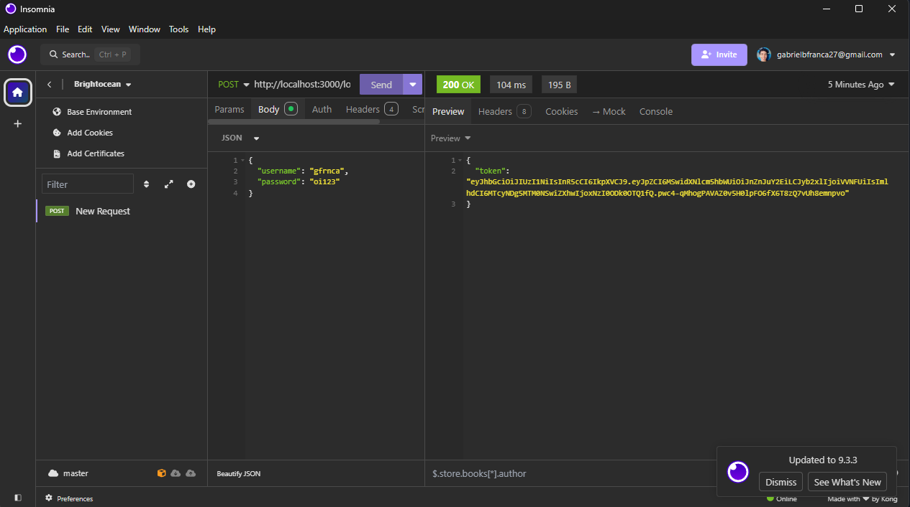

<h2 id="colab">🤝 Developers</h2>

Bruno de Paula (RM552226)

Kayque Lima (RM550782)

Gabriel França (RM551905)

Edward de Lima (RM98676)

Gabriel Francisco Lobo (RM99708)


<h2 id="technologies">💻 Technologies</h2>

- NodeJS

<h2 id="started">🚀 Getting started</h2>

Here you describe how to run your project locally

<h3>Pre</h3>

- NodeJS
- Git

<h3>Cloning</h3>

```bash
git clone https://github.com/brunofbpaula/TaskApp-Backend.git
```

<h3>Starting</h3>

```bash
cd taskapp-backend
npm i
npm run start
```

<h2 id="routes">📍 API Endpoints</h2>

List of the main routes.


| LOGIN               | handle operations that involve user authentication.                                          
|----------------------|-----------------------------------------------------
| <kbd>POST /login</kbd>     | if user exists, returns a jwt token
| <kbd>POST /registro</kbd>     | registers a new user


| TASKS               | handle operations that involve manipulation of tasks.                                          
|----------------------|-----------------------------------------------------
| <kbd>GET /tarefas</kbd>     | retrieves all tasks
| <kbd>POST /tarefas</kbd>     | creates a new task
| <kbd>GET /tarefas/id</kbd>     | retrieves a task
| <kbd>PUT /tarefas/id</kbd>     | updates a task
| <kbd>DELETE /tarefas/id</kbd>     | deletes a task


<h2 id="tests">Insomnia</h2>

<p>
    <h3>JWT Token</h3>
    
</p>